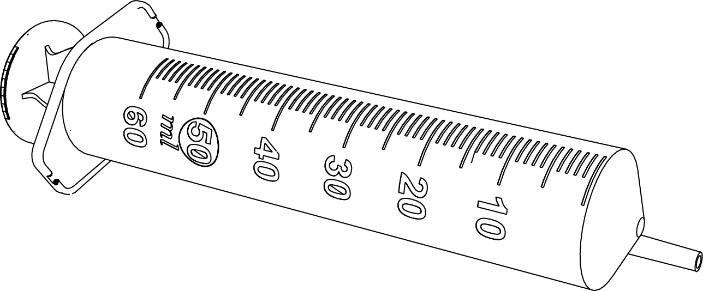

## **Things You Will Need**

|  |
| ---|:----------------| :-----:|
|1|A small shovel|   |
|2|A 30ml measuring tube|  |
|3| A bottle of Extraction Solution. Refer to the table below for the correct extraction solution for each parameter **||
|4|A syringe||
|5|A syringe filter (0.45μm)||
|6|A 10 ml measuring tube||
|7|A sample of soil||

***

|Parameter|Extraction Solution Name|
|:----|:----------------:|
|Nitrogen, Phosphate, Potassium, Boron, Zinc, Iron|Mehlich's Solution|
|Sulphur|Calcium Chloride Solution|
|pH|KCl Solution|
|Organic Carbon|No Extraction Solution|

  

***

## Steps

1. Collect a soil sample, and leave it in the sun for 10 minutes to dry. 

&nbsp;&nbsp;&nbsp;&nbsp;&nbsp;&nbsp;&nbsp;&nbsp;&nbsp;&nbsp;&nbsp;&nbsp;&nbsp;&nbsp;&nbsp;&nbsp;&nbsp;&nbsp; 
  

2. Take 25 ml of extraction solution (refer to the table in the previous section) in the 30ml mixing tube. Carefully pour small quantities of soil until the level of solution rises to 30 ml. 

&nbsp;&nbsp;&nbsp;&nbsp;&nbsp;&nbsp;&nbsp;&nbsp;&nbsp;&nbsp;&nbsp;&nbsp;&nbsp;&nbsp;&nbsp;&nbsp; 
  
3. Close the lid of the measuring chamber and shake it thoroughly to maximise the mixing of extract with the soil. Let the mixture sit for about 10 minutes until all the soil settles at the bottom. 

&nbsp;&nbsp;&nbsp;&nbsp;&nbsp;&nbsp;&nbsp;&nbsp;&nbsp;&nbsp;&nbsp;&nbsp;&nbsp;&nbsp;      

4. Dip the end of the syringe into the solution and draw out all of the extracted soil sample. 

 

5. Fix the syringe filter onto the adapter of the syringe, and filter the quantity of extract that you require for your test (refer to the specific test page) into the smaller measuring cylinder. 

&nbsp;&nbsp;&nbsp;&nbsp;&nbsp;&nbsp;&nbsp;&nbsp;&nbsp;&nbsp;&nbsp;&nbsp;&nbsp;&nbsp;&nbsp;&nbsp;&nbsp;&nbsp;&nbsp;&nbsp;&nbsp;&nbsp;&nbsp;&nbsp;&nbsp;&nbsp;&nbsp;&nbsp;&nbsp;&nbsp;&nbsp;&nbsp;&nbsp;&nbsp;&nbsp;&nbsp;&nbsp;&nbsp;&nbsp;&nbsp;&nbsp;&nbsp;&nbsp;&nbsp;&nbsp;&nbsp;&nbsp;&nbsp; 
