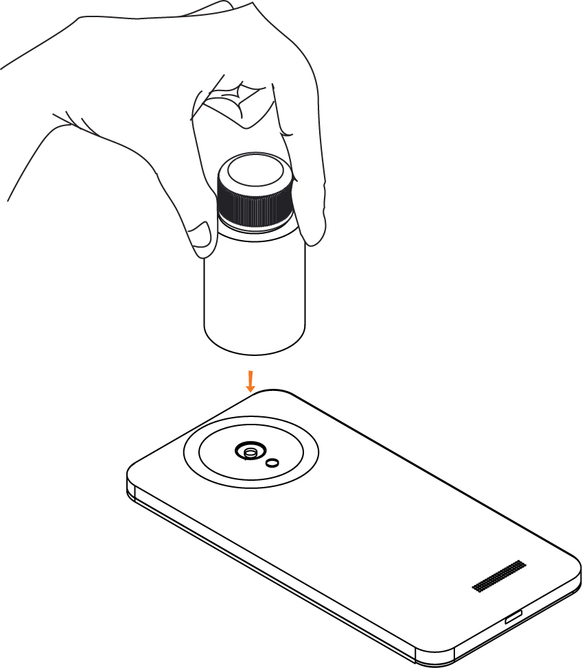

## **Things You Will Need**

|  |
| ---|:----------------| :-----:|
|1|One Bottle of Organic Carbon reagent A|   |
|2|One Bottle of Organic Carbon reagent B|   |
|3|A Cuvette and pipe||
|4|A smartphone with the ffem apps installed, and an alignment sticker||
|5|2 X 10ml measuring tube|&nbsp;&nbsp;&nbsp;&nbsp;|
|6|A sample of soil to test||
|7|A measuring spoon||
|8|Filter Paper||
|9|Funnel||

***

 

## Steps

1. Open the ffem Collect app, and select "Fill Blank Form". Select the form you need to fill out. 

&nbsp;&nbsp;&nbsp;&nbsp;&nbsp;&nbsp;&nbsp;&nbsp;&nbsp;&nbsp;&nbsp;&nbsp;&nbsp;&nbsp;&nbsp;&nbsp;&nbsp;&nbsp;&nbsp;&nbsp;
 

2. Answer all the questions in the form, swiping left to go to the next questions. When you reach the soil quality questions, launch the test for Organic Carbon 

&nbsp;&nbsp;&nbsp;&nbsp;&nbsp;&nbsp;&nbsp;&nbsp;&nbsp;&nbsp;&nbsp;&nbsp;&nbsp;&nbsp;&nbsp;&nbsp;&nbsp;&nbsp;&nbsp;&nbsp; 

3. Rinse the empty cuvette and measuring tube twice with the sample to remove any traces of previous solutions. Take 1 spoon of the soil sample, and add it to the measuring tube. 

&nbsp;&nbsp;&nbsp;&nbsp;&nbsp;&nbsp;&nbsp;&nbsp;&nbsp;&nbsp;&nbsp;&nbsp;&nbsp;&nbsp;&nbsp;&nbsp;&nbsp;&nbsp;&nbsp;&nbsp;   

4. Add 5 ml of Reagent A and 5 ml of Reagent B to the measuring tube. Close the lid and shake the tube to help the reaction. Leave the measuring tube for 10 minutes to allow the reaction to progress.

&nbsp;&nbsp;&nbsp;&nbsp;&nbsp;&nbsp;&nbsp;&nbsp;&nbsp;&nbsp;&nbsp;&nbsp;&nbsp;&nbsp;&nbsp;&nbsp;&nbsp;&nbsp;&nbsp;&nbsp;
 

5. Take the filter paper, fold it as shown and place it in the funnel. Place the funnel in the second measuring tube. Filter the sample mixture from the first measuring tube into the second measuring tube. 

  
&nbsp;&nbsp;&nbsp;&nbsp;&nbsp;&nbsp;&nbsp;&nbsp;&nbsp;&nbsp;&nbsp;&nbsp;&nbsp;&nbsp;&nbsp;&nbsp;&nbsp;&nbsp;&nbsp;&nbsp;&nbsp;&nbsp;&nbsp;&nbsp;&nbsp;&nbsp;&nbsp; 

6. Pour 5 ml of this filtered solution from the mixing tube into the provided cuvette. Close the lid and fit the cuvette into the pipe. 

 &nbsp;&nbsp;&nbsp;&nbsp;&nbsp;&nbsp;&nbsp;&nbsp;&nbsp;&nbsp;&nbsp;&nbsp;&nbsp;&nbsp;&nbsp;&nbsp;&nbsp;&nbsp;&nbsp;&nbsp;&nbsp;&nbsp;&nbsp;&nbsp;&nbsp;&nbsp;&nbsp;&nbsp;&nbsp;&nbsp;&nbsp;&nbsp;&nbsp;&nbsp;&nbsp;&nbsp;&nbsp;&nbsp;&nbsp;&nbsp;
 

7. Launch the test on the app selecting "No Dilution" on the next screen.  

&nbsp;&nbsp;&nbsp;&nbsp;&nbsp;&nbsp;&nbsp;&nbsp;&nbsp;&nbsp;&nbsp;&nbsp;&nbsp;&nbsp;&nbsp;&nbsp;&nbsp;&nbsp;&nbsp;&nbsp;
  

8. Place the phone face down, and use the sticker to help center the cuvette over the camera. Wait for about a minute for the test to complete - you will hear 6 beeps and a "Test Completion" sound. 

&nbsp;&nbsp;&nbsp;&nbsp;&nbsp;&nbsp;&nbsp;&nbsp;&nbsp;&nbsp;&nbsp;&nbsp;&nbsp;&nbsp;&nbsp;&nbsp;&nbsp;&nbsp;&nbsp;&nbsp;&nbsp;&nbsp;&nbsp;&nbsp;&nbsp;&nbsp;&nbsp;&nbsp;&nbsp;&nbsp;&nbsp;&nbsp;&nbsp;&nbsp;&nbsp;&nbsp;&nbsp;&nbsp;&nbsp;&nbsp;
  

9. You should receive a contaminant concentration value in %. Tap Accept Result to return to the survey. 

&nbsp;&nbsp;&nbsp;&nbsp;&nbsp;&nbsp;&nbsp;&nbsp;&nbsp;&nbsp;&nbsp;&nbsp;&nbsp;&nbsp;&nbsp;&nbsp;&nbsp;&nbsp;&nbsp;
     

10. Complete the rest of the survey, and submit it once you have filled in all the forms. Empty the contents of the cuvette and rinse it once. 

&nbsp;&nbsp;&nbsp;&nbsp;&nbsp;&nbsp;&nbsp;&nbsp;&nbsp;&nbsp;&nbsp;&nbsp;&nbsp;&nbsp;&nbsp;&nbsp;&nbsp;&nbsp;&nbsp;

