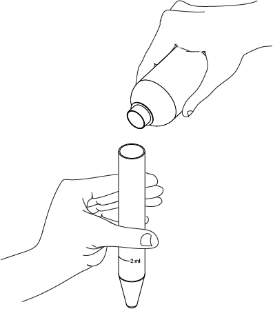
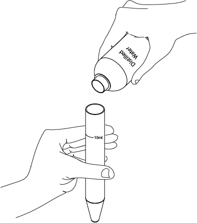
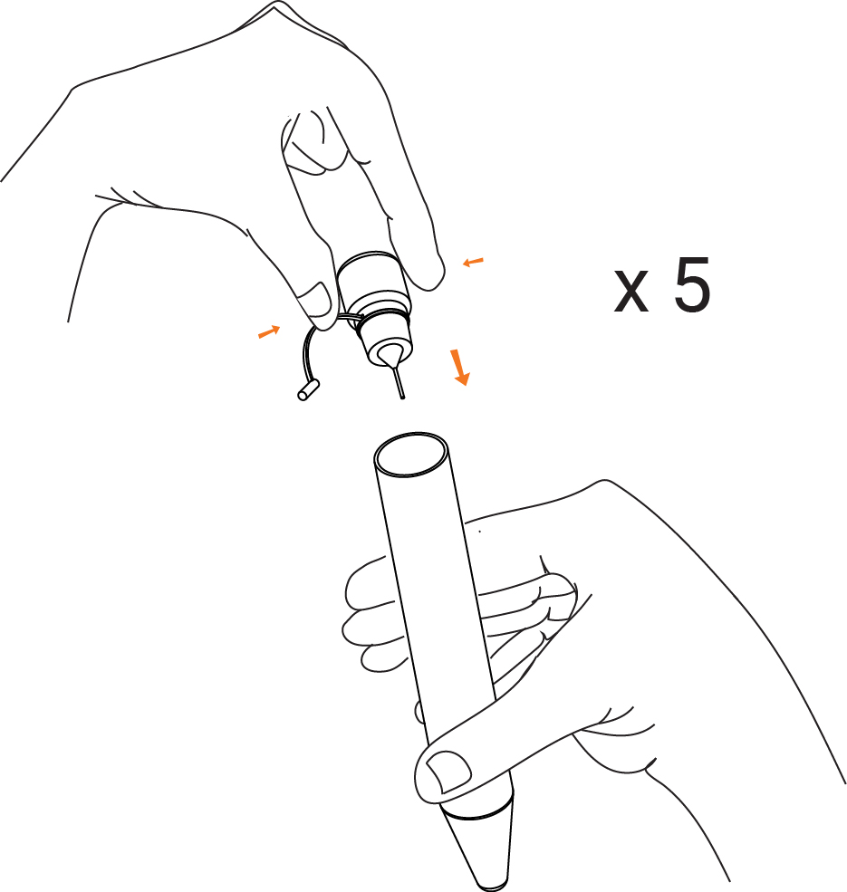
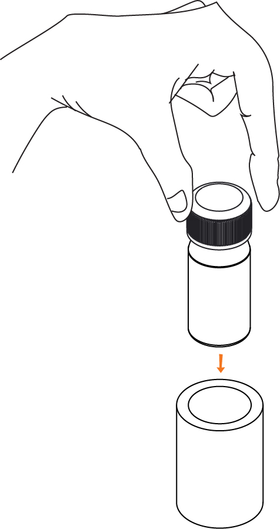
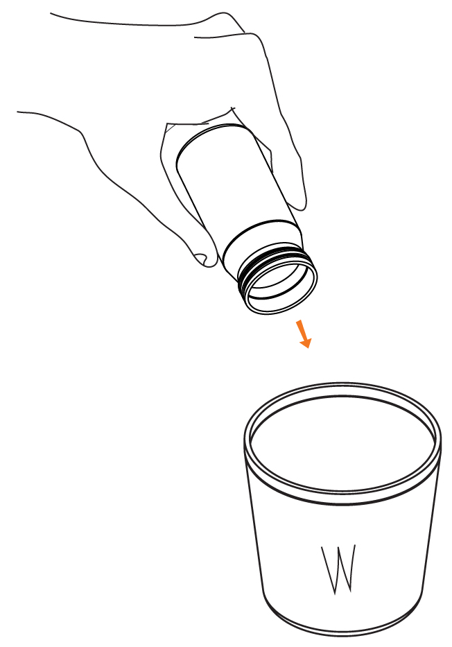

## **Things You Will Need**

|  |
| ---|:----------------| :-----:|
|1|1 Dropper of Phosphorous Reagent|   |
|2|A Cuvette and pipe||
|3|A smartphone with the ffem apps installed, and an alignment sticker||
|4|A 10ml measuring tube||
|5|A sample of [soil extract](https://github.com/foundation-for-environmental-monitoring/Documentation/wiki/Extraction) to test||
|6|A bottle of distilled water||

***
  

Note: Before testing, you must have a solution of [soil extract](https://github.com/foundation-for-environmental-monitoring/Documentation/wiki/Extraction). refer to the soil extraction manual for instructions on how to prepare it.
    

## Steps

1. Open the ffem Collect app, and select "Fill Blank Form". Select the form you need to fill out. 

&nbsp;&nbsp;&nbsp;&nbsp;&nbsp;&nbsp;&nbsp;&nbsp;&nbsp;&nbsp;&nbsp;&nbsp;&nbsp;&nbsp;&nbsp;&nbsp;&nbsp;&nbsp;&nbsp;&nbsp;
 

2. Answer all the questions in the form, swiping left to go to the next questions. When you reach the soil quality questions, launch the test for Phosphorous 

&nbsp;&nbsp;&nbsp;&nbsp;&nbsp;&nbsp;&nbsp;&nbsp;&nbsp;&nbsp;&nbsp;&nbsp;&nbsp;&nbsp;&nbsp;&nbsp;&nbsp;&nbsp;&nbsp;&nbsp; 

3. Rinse the empty cuvette and measuring tube twice with the sample to remove any traces of previous solutions. 

   

4. Measure 2 ml of the sample with the measuring tube. Add 8ml of distilled water to bring the total volume upto 10ml  

&nbsp;&nbsp;&nbsp;&nbsp;&nbsp;&nbsp;&nbsp;&nbsp;&nbsp;&nbsp;&nbsp;&nbsp;&nbsp;&nbsp;&nbsp;&nbsp;
 

5. Add 5 drops Phosphorous Reagent. Close the lid of the measuring tube and shake it to ensure proper mixing of the reagent and sample.  

&nbsp;&nbsp;&nbsp;&nbsp;&nbsp;&nbsp;&nbsp;&nbsp;&nbsp;&nbsp;&nbsp;&nbsp;&nbsp;&nbsp;&nbsp;&nbsp;
 

6. Pour the contents of the mixing tube into the provided cuvette. Close the lid and fit the cuvette into the pipe.  

 &nbsp;&nbsp;&nbsp;&nbsp;&nbsp;&nbsp;&nbsp;&nbsp;&nbsp;&nbsp;&nbsp;&nbsp;&nbsp;&nbsp;&nbsp;&nbsp;&nbsp;&nbsp;&nbsp;&nbsp;&nbsp;&nbsp;&nbsp;&nbsp;&nbsp;&nbsp;&nbsp;&nbsp;&nbsp;&nbsp;&nbsp;&nbsp;&nbsp;&nbsp;&nbsp;&nbsp;&nbsp;&nbsp;&nbsp;&nbsp;
     

7. Launch the test on the app selecting "No Dilution" on the next screen.  

&nbsp;&nbsp;&nbsp;&nbsp;&nbsp;&nbsp;&nbsp;&nbsp;&nbsp;&nbsp;&nbsp;&nbsp;&nbsp;&nbsp;&nbsp;&nbsp;&nbsp;&nbsp;&nbsp;&nbsp;
 

8. Place the phone face down, and use the sticker to help center the cuvette over the camera. Wait for 5 minutes for the test to complete - you will hear 6 beeps and a "Test Completion" sound. 

&nbsp;&nbsp;&nbsp;&nbsp;&nbsp;&nbsp;&nbsp;&nbsp;&nbsp;&nbsp;&nbsp;&nbsp;&nbsp;&nbsp;&nbsp;&nbsp;&nbsp;&nbsp;&nbsp;&nbsp;&nbsp;&nbsp;&nbsp;&nbsp;&nbsp;&nbsp;&nbsp;&nbsp;&nbsp;&nbsp;&nbsp;&nbsp;&nbsp;&nbsp;&nbsp;&nbsp;&nbsp;&nbsp;&nbsp;&nbsp;
 

9. You should receive a contaminant concentration value in ppm. Tap Accept Result to return to the survey. 

&nbsp;&nbsp;&nbsp;&nbsp;&nbsp;&nbsp;&nbsp;&nbsp;&nbsp;&nbsp;&nbsp;&nbsp;&nbsp;&nbsp;&nbsp;&nbsp;&nbsp;&nbsp;&nbsp;
<br      
   
10. Complete the rest of the survey, and submit it once you have filled in all the forms. Empty the contents of the cuvette and rinse it once. 

&nbsp;&nbsp;&nbsp;&nbsp;&nbsp;&nbsp;&nbsp;&nbsp;&nbsp;&nbsp;&nbsp;&nbsp;&nbsp;&nbsp;&nbsp;&nbsp;&nbsp;&nbsp;&nbsp;

