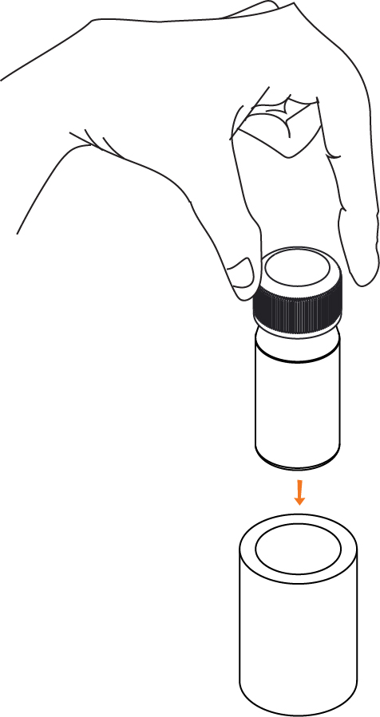

## **Things You Will Need**

|  |
| ---|:----------------| :-----:|
|1|One Dropper of Zinc reagent A|   |
|2|One Dropper of Zinc reagent B|   |
|3|One Dropper of Zinc reagent C|   |
|4|One Dropper of Zinc reagent D|   |
|5|A Cuvette and pipe||
|6|A smartphone with the ffem apps installed, and an alignment sticker||
|7|A 10ml measuring tube||
|8|A sample of [soil extract](https://github.com/foundation-for-environmental-monitoring/Documentation/wiki/Extraction) to test||
|9|A bottle of Distilled water|   |

***
Note: Before testing, you must have a solution of [soil extract](https://github.com/foundation-for-environmental-monitoring/Documentation/wiki/Extraction). refer to the soil extraction manual for instructions on how to prepare it.

## Steps

1. Open the ffem Collect app, and select "Fill Blank Form". Select the form you need to fill out. 

&nbsp;&nbsp;&nbsp;&nbsp;&nbsp;&nbsp;&nbsp;&nbsp;&nbsp;&nbsp;&nbsp;&nbsp;&nbsp;&nbsp;&nbsp;&nbsp;&nbsp;&nbsp;&nbsp;&nbsp;
 

2. Answer all the questions in the form, swiping left to go to the next questions. When you reach the soil quality questions, launch the test for Zinc 

&nbsp;&nbsp;&nbsp;&nbsp;&nbsp;&nbsp;&nbsp;&nbsp;&nbsp;&nbsp;&nbsp;&nbsp;&nbsp;&nbsp;&nbsp;&nbsp;&nbsp;&nbsp;&nbsp;&nbsp; 

3. Rinse the empty cuvette and measuring tube twice with the sample extract to remove any traces of previous solutions. Measure 5 ml of the extract with the measuring tube. 

&nbsp;&nbsp;&nbsp;&nbsp;&nbsp;&nbsp;&nbsp;&nbsp;&nbsp;&nbsp;&nbsp;&nbsp;&nbsp;&nbsp;&nbsp;&nbsp;
 

5. Add **10 drops** of Zinc Reagent A, swirling the measuring tube to mix the sample. Similarly, add **5 drops** of reagent B, **5 drops** of reagent C, and **3 drops** of reagent D. Close the lid of the measuring tube and shake it to ensure proper mixing of the reagent and sample. 

&nbsp;&nbsp;&nbsp;&nbsp;&nbsp;&nbsp;&nbsp;&nbsp;&nbsp;&nbsp;&nbsp;
&nbsp;&nbsp;&nbsp;&nbsp;&nbsp;&nbsp;&nbsp;&nbsp;&nbsp;&nbsp;&nbsp;
&nbsp;&nbsp;&nbsp;&nbsp;&nbsp;&nbsp;&nbsp;&nbsp;&nbsp;&nbsp;&nbsp;&nbsp;&nbsp;
&nbsp;&nbsp;&nbsp;&nbsp;&nbsp;&nbsp;&nbsp;&nbsp;&nbsp;&nbsp;&nbsp;&nbsp;&nbsp; 

7. Pour the contents of the mixing tube into the cuvette. Close the lid and fit the cuvette into the pipe. 

 &nbsp;&nbsp;&nbsp;&nbsp;&nbsp;&nbsp;&nbsp;&nbsp;&nbsp;&nbsp;&nbsp;&nbsp;&nbsp;&nbsp;&nbsp;&nbsp;&nbsp;&nbsp;&nbsp;&nbsp;&nbsp;&nbsp;&nbsp;&nbsp;&nbsp;&nbsp;&nbsp;&nbsp;&nbsp;&nbsp;&nbsp;&nbsp;&nbsp;&nbsp;&nbsp;&nbsp;&nbsp;&nbsp;&nbsp;&nbsp;
 

8. Launch the test on the app selecting "No Dilution" on the next screen.  

&nbsp;&nbsp;&nbsp;&nbsp;&nbsp;&nbsp;&nbsp;&nbsp;&nbsp;&nbsp;&nbsp;&nbsp;&nbsp;&nbsp;&nbsp;&nbsp;&nbsp;&nbsp;&nbsp;&nbsp;
 

9. Place the phone face down, and use the sticker to help center the cuvette over the camera. Wait for 10 minutes for the test to complete - you will hear 6 beeps and a "Test Completion" sound. 

&nbsp;&nbsp;&nbsp;&nbsp;&nbsp;&nbsp;&nbsp;&nbsp;&nbsp;&nbsp;&nbsp;&nbsp;&nbsp;&nbsp;&nbsp;&nbsp;&nbsp;&nbsp;&nbsp;&nbsp;&nbsp;&nbsp;&nbsp;&nbsp;&nbsp;&nbsp;&nbsp;&nbsp;&nbsp;&nbsp;&nbsp;&nbsp;&nbsp;&nbsp;&nbsp;&nbsp;&nbsp;&nbsp;&nbsp;&nbsp;
 

10. You should receive a contaminant concentration value in ppm. Tap Accept Result to return to the survey. 

&nbsp;&nbsp;&nbsp;&nbsp;&nbsp;&nbsp;&nbsp;&nbsp;&nbsp;&nbsp;&nbsp;&nbsp;&nbsp;&nbsp;&nbsp;&nbsp;&nbsp;&nbsp;&nbsp;
 

11. Complete the rest of the survey, and submit it once you have filled in all the forms. Empty the contents of the cuvette and rinse it once. 

&nbsp;&nbsp;&nbsp;&nbsp;&nbsp;&nbsp;&nbsp;&nbsp;&nbsp;&nbsp;&nbsp;&nbsp;&nbsp;&nbsp;&nbsp;&nbsp;&nbsp;

