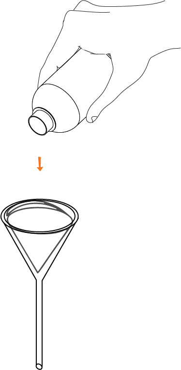
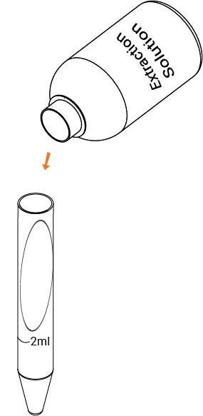
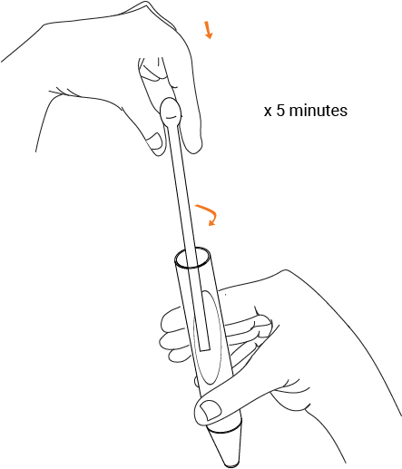

|#|Item|Image|
|:----|:----------------|:-----:|
|1|Extraction Solvent|  |
|3|A Cuvette and pipe||
|4|A smartphone with the ffem apps installed, and an alignment sticker||
|5|Whatman filter/Glass fiber filter||
|6|A sample of water to test||
|7|plastic funnel ||
|8|Glass rod | |

***
       

## Steps

1. Open the ffem Collect app, and select "Fill Blank Form". Select the form you need to fill out. 

&nbsp;&nbsp;&nbsp;&nbsp;&nbsp;&nbsp;&nbsp;&nbsp;&nbsp;&nbsp;&nbsp;&nbsp;&nbsp;&nbsp;&nbsp;&nbsp;&nbsp;&nbsp;&nbsp;&nbsp;
 

2. Answer all the questions in the form, swiping left to go to the next questions. When you reach the water quality questions, launch the test for Chlorophyll-A 

&nbsp;&nbsp;&nbsp;&nbsp;&nbsp;&nbsp;&nbsp;&nbsp;&nbsp;&nbsp;&nbsp;&nbsp;&nbsp;&nbsp;&nbsp;&nbsp;&nbsp;&nbsp;&nbsp;&nbsp; 

3. Rinse the empty cuvette and measuring tube twice with the sample to remove any traces of previous solutions. 

 
  
4. Fold the filter paper as shown and place it in the funnel as shown. Filter approximately 100ml of sample through the filter paper. The filtered sample can be discarded, but keep the filter paper for the next step. 

 &nbsp;&nbsp;&nbsp;&nbsp;&nbsp;&nbsp;&nbsp;&nbsp;&nbsp;&nbsp;&nbsp;&nbsp;&nbsp;&nbsp;&nbsp;&nbsp;&nbsp;&nbsp;&nbsp;&nbsp;&nbsp;&nbsp;&nbsp;&nbsp;&nbsp;&nbsp;&nbsp;&nbsp;&nbsp;&nbsp;&nbsp;&nbsp;

5. Remove the filter paper, unfold it and place it in the measuring tube. Add 2ml of extraction solution to the filter paper in the measuring tube.   

&nbsp;&nbsp;&nbsp;&nbsp;&nbsp;&nbsp;&nbsp;&nbsp;&nbsp;&nbsp;&nbsp;&nbsp;&nbsp;&nbsp;&nbsp;&nbsp;&nbsp;&nbsp;&nbsp;&nbsp;&nbsp;&nbsp;&nbsp;&nbsp;&nbsp;&nbsp;&nbsp;&nbsp;&nbsp;&nbsp;&nbsp;&nbsp;

6. Use the glass rod to crush and remove the algal cells trapped on the paper. The pigment will start slowly releasing in to the solvent.Continue crushing of the sample util the greenish colour disappears from the filter - this could take up to five minutes. Once this step is completed, add more extraction solution until it reaches the 10ml mark. 

&nbsp;&nbsp;&nbsp;&nbsp;&nbsp;&nbsp;&nbsp;&nbsp;&nbsp;&nbsp;&nbsp;&nbsp;&nbsp;&nbsp;&nbsp;&nbsp;&nbsp;&nbsp;&nbsp;&nbsp;&nbsp;&nbsp;&nbsp;&nbsp;&nbsp;&nbsp;&nbsp;&nbsp;&nbsp;&nbsp;&nbsp;&nbsp;&nbsp;&nbsp;&nbsp;&nbsp;&nbsp;&nbsp;&nbsp;&nbsp;&nbsp;&nbsp;&nbsp;&nbsp;&nbsp;&nbsp;&nbsp;&nbsp;
 

  
7. Take another filter paper ad place it in the funnel. Filter the extracted sample through the funnel, directly into the borosil cuvette. Close the lid and fit the cuvette into the pipe. 

 &nbsp;&nbsp;&nbsp;&nbsp;&nbsp;&nbsp;&nbsp;&nbsp;&nbsp;&nbsp;&nbsp;&nbsp;&nbsp;&nbsp;&nbsp;&nbsp;&nbsp;&nbsp;&nbsp;&nbsp;&nbsp;&nbsp;&nbsp;&nbsp;&nbsp;&nbsp;&nbsp;&nbsp;&nbsp;&nbsp;&nbsp;&nbsp;&nbsp;&nbsp;&nbsp;&nbsp;&nbsp;&nbsp;&nbsp;&nbsp;
 

8. Launch the test on the app selecting "No Dilution" on the next screen.  

&nbsp;&nbsp;&nbsp;&nbsp;&nbsp;&nbsp;&nbsp;&nbsp;&nbsp;&nbsp;&nbsp;&nbsp;&nbsp;&nbsp;&nbsp;&nbsp;&nbsp;&nbsp;&nbsp;&nbsp;
 

9. Place the phone face down, and use the sticker to help center the cuvette over the camera. Wait for 10 minutes for the test to complete - you will hear 6 beeps and a "Test Completion" sound. 

&nbsp;&nbsp;&nbsp;&nbsp;&nbsp;&nbsp;&nbsp;&nbsp;&nbsp;&nbsp;&nbsp;&nbsp;&nbsp;&nbsp;&nbsp;&nbsp;&nbsp;&nbsp;&nbsp;&nbsp;&nbsp;&nbsp;&nbsp;&nbsp;&nbsp;&nbsp;&nbsp;&nbsp;&nbsp;&nbsp;&nbsp;&nbsp;&nbsp;&nbsp;&nbsp;&nbsp;&nbsp;&nbsp;&nbsp;&nbsp;
 
  
10. You should receive a contaminant concentration value in ppm. Tap Accept Result to return to the survey. 

&nbsp;&nbsp;&nbsp;&nbsp;&nbsp;&nbsp;&nbsp;&nbsp;&nbsp;&nbsp;&nbsp;&nbsp;&nbsp;&nbsp;&nbsp;&nbsp;&nbsp;&nbsp;&nbsp;
 

11. Empty the contents of the cuvette and rinse it once. 

12. Complete the rest of the survey, and submit it once you have filled in all the forms. 

