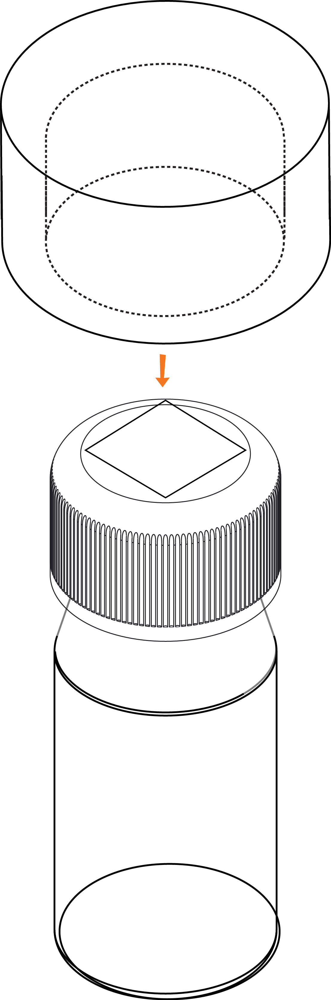

## **Things You Will Need**

|#|Item|Image|
|:----|:----------------|:-----:|
|1|1 bottle of Arsenic Reagent A|  |
|2|1 bottle of Arsenic Reagent B|  |
|3|1 bottle of Arsenic Reagent C|  |
|4|1 Arsenic test strip|  |
|5|A Cuvette and pipe||
|6|A smartphone with the ffem apps installed, and an alignment sticker||
|7|A 10 ml measuring tube||
|8|A sample of water to test||

***

       

## Steps

1. Open the ffem Collect app, and select "Fill Blank Form". Select the form you need to fill out. 

&nbsp;&nbsp;&nbsp;&nbsp;&nbsp;&nbsp;&nbsp;&nbsp;&nbsp;&nbsp;&nbsp;&nbsp;&nbsp;&nbsp;&nbsp;&nbsp;&nbsp;&nbsp;&nbsp;&nbsp;
 

2. Answer all the questions in the form, swiping left to go to the next questions. When you reach the water quality questions, launch the test for Arsenic 

&nbsp;&nbsp;&nbsp;&nbsp;&nbsp;&nbsp;&nbsp;&nbsp;&nbsp;&nbsp;&nbsp;&nbsp;&nbsp;&nbsp;&nbsp;&nbsp;&nbsp;&nbsp;&nbsp;&nbsp; 

3. Rinse the empty cuvette and measuring tube twice with the sample to remove any traces of previous solutions. Measure 5 ml of the sample with the measuring tube. 

&nbsp;&nbsp;&nbsp;&nbsp;&nbsp;&nbsp;&nbsp;&nbsp;&nbsp;&nbsp;&nbsp;&nbsp;&nbsp;

4. Pour the sample into the cuvette. using the provided spoon, add two spoons of reagent 1, 1 spoon of reagent 2 and 6 spoons of reagent 3. Gently swirl the solution to speed up the reaction, without letting anything spil. 

&nbsp;&nbsp;&nbsp;&nbsp;&nbsp;&nbsp;&nbsp;&nbsp;&nbsp;&nbsp;&nbsp;&nbsp;

&nbsp;&nbsp;&nbsp;&nbsp;&nbsp;&nbsp;&nbsp;&nbsp;&nbsp;
 

5. Screw the lid of the cuvette. Using the provided tweezer, place the arsenic strip over the hole of the cap.Quickly place the cover over the strip.  

&nbsp;&nbsp;&nbsp;
&nbsp;&nbsp;&nbsp;&nbsp;&nbsp;&nbsp;&nbsp;&nbsp;&nbsp;&nbsp;&nbsp;&nbsp;&nbsp;&nbsp;&nbsp;&nbsp;&nbsp;&nbsp;&nbsp;&nbsp;&nbsp;&nbsp;&nbsp;&nbsp;&nbsp;&nbsp;&nbsp;&nbsp;&nbsp;&nbsp;&nbsp;&nbsp;
 

6. Leave the sample to sit for 5 minutes. The reaction will proceed, releasing a gas that will create a color on the test strip. Once 5 minutes have passed, unscrew the lid of the cuvette (without removing the pipe and strip). 

&nbsp;&nbsp;&nbsp;&nbsp;&nbsp;&nbsp;&nbsp;&nbsp;&nbsp;&nbsp;&nbsp;&nbsp;&nbsp;&nbsp;&nbsp;&nbsp;&nbsp;&nbsp;&nbsp;&nbsp;&nbsp;&nbsp;&nbsp;&nbsp;&nbsp;&nbsp;&nbsp;&nbsp;&nbsp;&nbsp;&nbsp;&nbsp;

7. Launch the test from the ffem water app, and place your phone face down. Use the alignment sticker to help center the pipe+cap+test strip combo over the phone camera. Wait for a minute for the test to complete - you will hear 6 beeps and a "Test Completion" sound. 

&nbsp;&nbsp;&nbsp;&nbsp;&nbsp;&nbsp;&nbsp;&nbsp;&nbsp;&nbsp;&nbsp;&nbsp;&nbsp;&nbsp;&nbsp;&nbsp;
 

8. You should receive a contaminant concentration value in ppm. Tap Accept Result to return to the survey. 

&nbsp;&nbsp;&nbsp;&nbsp;&nbsp;&nbsp;&nbsp;&nbsp;&nbsp;&nbsp;&nbsp;&nbsp;&nbsp;&nbsp;&nbsp;&nbsp;&nbsp;&nbsp;&nbsp;
 

9. Complete the rest of the survey, and submit it once you have filled in all the forms. Empty the contents of the cuvette and make sure to rinse it properly. 

&nbsp;&nbsp;&nbsp;&nbsp;&nbsp;&nbsp;&nbsp;&nbsp;&nbsp;&nbsp;&nbsp;&nbsp;&nbsp;&nbsp;&nbsp;&nbsp;

